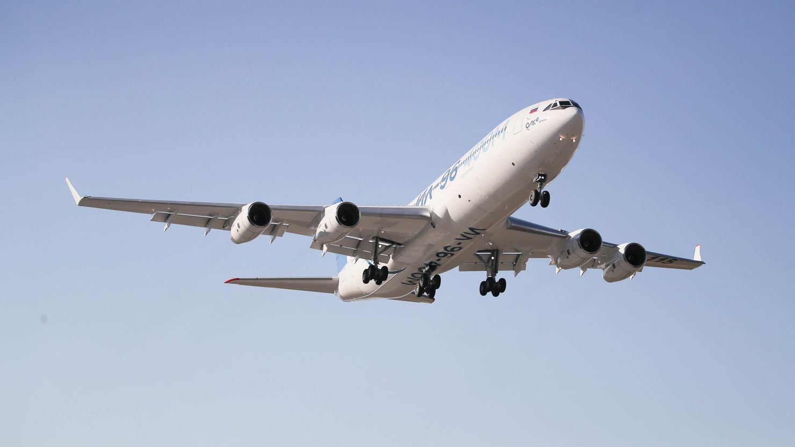
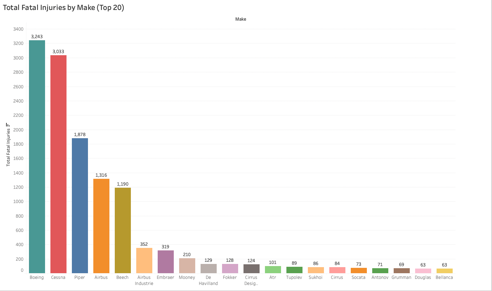
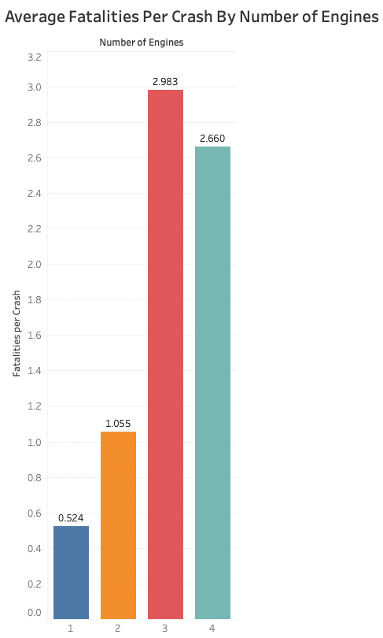
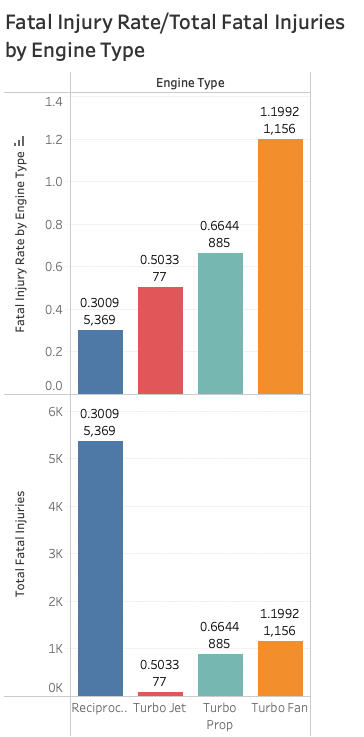
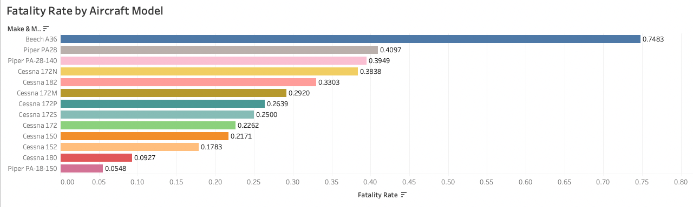

# Aircraft Analysis



Author : Jose Ortega

## Overview

In this project, I will use data cleaning, analysis and visualizations in order to generate insights for a business stakeholder.

## Business Problem

My company is expanding in to new industries to diversify its portfolio. Specifically, they are interested in buying and operating aircrafts for commercial and private use, but do not know anything about the potential risks of aircraft. My task is to analyse the data and come up with three business recommendations.

## The Data

The data used in this project is from the NTSB (National Transportation and Safety Board), that contains information from 1962 and later about civil aviation accidents and selected incidents within tha United States, its territories and possessions, and international waters. Some of the important variables in the dataset are : Aircraft damage, category, make, model, number of engines, engine type, injury severity and total injuries.

The original dataset can be found here __[link text](https://www.kaggle.com/datasets/khsamaha/aviation-accident-database-synopses)__

## Methods

In this project we use descriptive analysis, first we understand/inspect the dataset given, then we clean and prepare the data (basically we get rid of colummns that we are not going to use and we also deal with the missing values), once the data is cleaned I will analyze the data , interpret the results and communicate the findings.


## Results
### Visual 1


Visual number 1 is "Total Fatal Injuries by Make" , this first chart tell us which aircraft makes have been involved in the highest number of fatal incidents, but this does not necessarily mean they are the most dangerous (Boeing and Cessna for example) , these reflects that these manufacturers have a much larger number of aircraft in operation meaning they are the most popular makes in those years.

### Visual 2


Visual number 2 is "Average Fatalities Per Crash by Number of Engines", we can see in this visualization that fatalities per crash tend to increase with the number of engines.

### Visual 3


Visual number 3 is "Fatal Injury Rate and Total Fatal Injuries by Engine Type", this will give us a good insight about which engine type are safest one.

### Visual 4


Visual number 4 is  "Fatality Rate by Aircraft Model (Top15), this visualization is useful to understand which aircraft model are the safetest using fatality rate as a measurement.


## Conclusions

This project leads to three recommendations:

1.- We recommend the company prioritize aircraft with 2 or 4 engines. These configurations offer a strong balance of safety and redundancy, allowing     continued flight in the event of an engine failure.
    While single-engine aircraft have a lower fatality rate per crash, they account for a higher total number of fatalities due to their widespread      use and lack of engine redundancy. Conversely, 3-engine aircraft, despite having fewer total fatalities than 4-engine aircraft, show a higher        average fatality rate, suggesting more severe outcomes when incidents occur. For these reasons we think 2 and 4 engine aircraft represent a          safer and more reliable option.

2.- We recommend the company prioritize reciprocating engines over turboprop for general aviation purposes. Reciprocating engines demonstrate the        lowest fatality rate, indicating they are not only common in general aviation but also associated with less severe outcomes in the event of an       incident.For larger or commercial aircraft, we recommend turbofan engines, as they are standard in commercial aviation despite their higher          fatality rate—primarily due to their use in high-capacity aircraft.We do not recommend turbojet engines, as they are primarily used in military      aviation and are less suitable for commercial or civilian applications.

3.- We recommend the company consider the Piper PA-18-150 and Cessna 180, which show the lowest fatality rates, indicating safer outcomes in             accidents.Additionally, Cessna 172 variants demonstrate consistently low to moderate fatality rates, reinforcing their reputation as safe and        reliable choices for general aviation.


## For More Information

Please review our full analysis in [our Jupyter Notebook](./dsc-phase1-project-template.ipynb) and our [presentation](./Risk_Aviation_Project.pdf)

For any additional questions, please contact Jose Ortega at [joseorteorbe@gmail.com](mailto:joseorteorbe@gmail.com) 


## Repository Structure

```
├── data
├── images
├── .gitignore
├── README.md
├── Risk_Aviation_Project.pdf
└── Risk_Aviation_Project.ipynb
```

